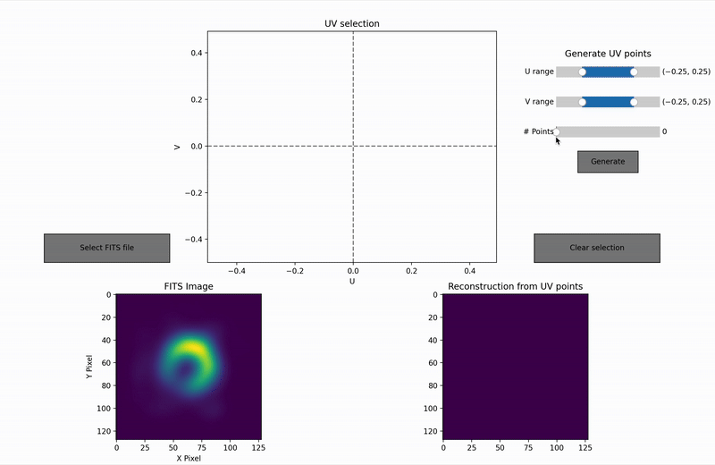
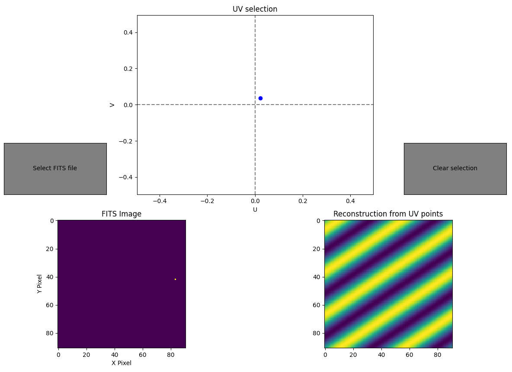
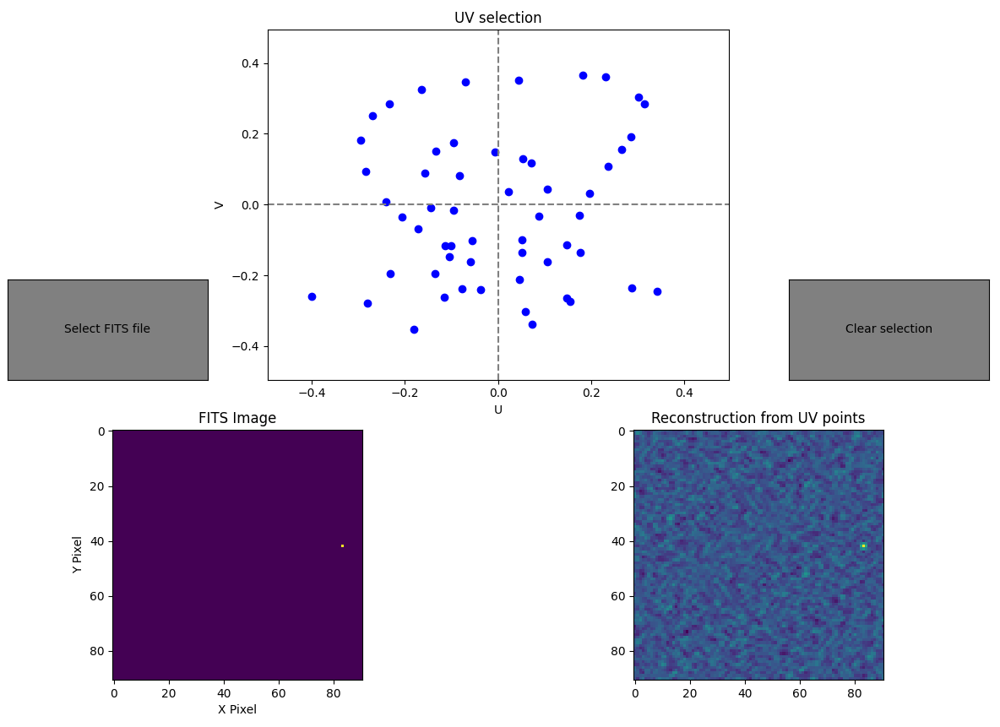
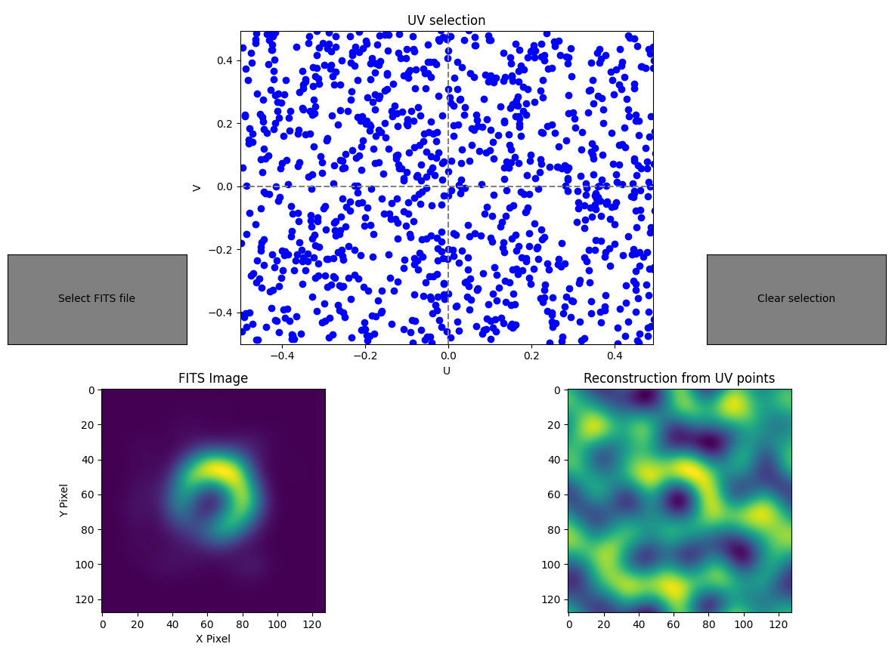
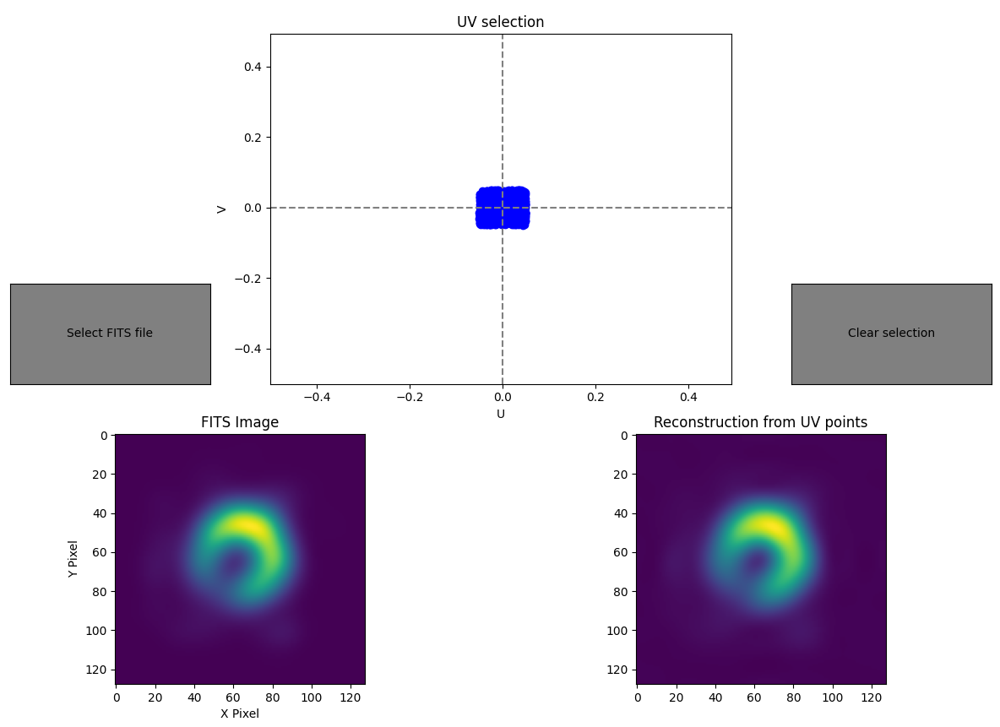

# FITS file reconstructor visualizer
A *very* simple app for me to learn more about how UV coverage works for a given FITS file. 

Allows you to load a fits file, select UV points and see how the UV coverage affects the reconstruction of the original image. 

## How to run
1. Clone the repository 
~~~~
git clone https://github.com/AndreasH96/fits-uv-visualizer.git 
cd ./fits-uv-visualizer
~~~~
2. Install requirements
~~~~
pip install -r requirements.txt
~~~~

3. Run the application
~~~~
python app.py
~~~~

## Example: Single point selected

## Example: Multiple points selected

In the example with multiple points selected, we can see that the actual image (point source, nothing fancy) can be somewhat seen from the reconstruction.

## Example: Placements of UV points (M87)
### 1000 randomly placed points:

### 1000 randomly placed points, with a maximum UV distance of 0.05 (to focus on capturing general aspects):

# Todo:
- [x] Generate N random UV points with min and max UV distance
- [ ] Phase shifting ?
- [ ] Load file of UV points
- [ ] Evaluate UV ranges, should allow other than the fixed -0.5 - 0.5?